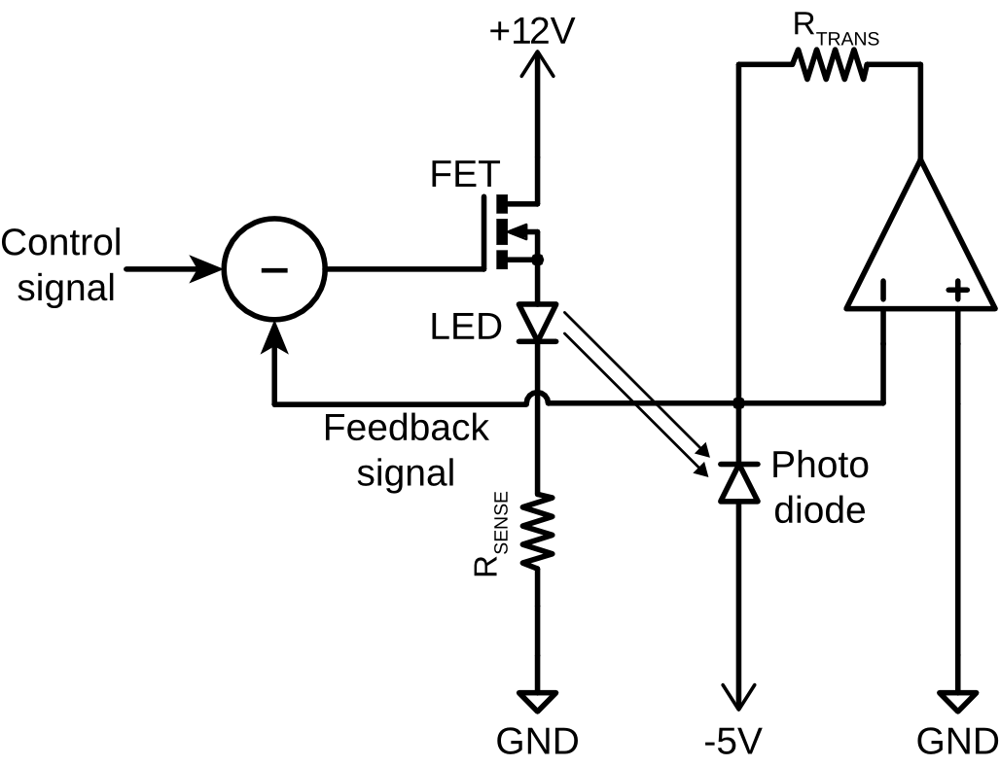
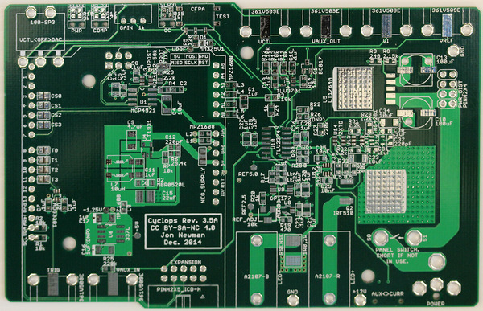
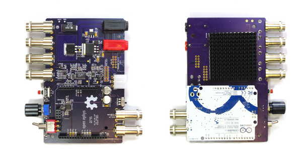
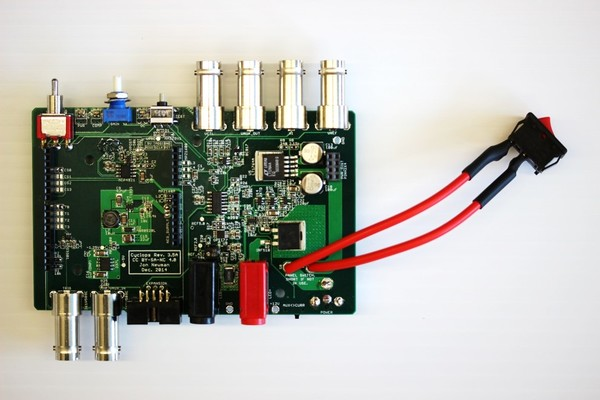
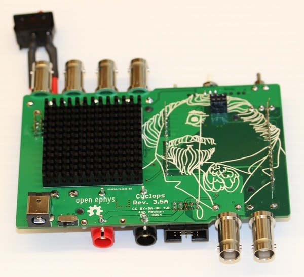

__Cyclops__ is a high-power LED driver that enables precise control of light
power for optogenetic stimulation. The circuit was developed by Jon Newman
while in Steve Potter's lab at Georgia Tech in order to complete his thesis
work, which required the delivery of ultra-precise, continuously time-varying
light waveforms for optogenetic stimulation ([1][1],[2][2]).  This was, and still is, not
possible with commercial hardware for optogenetic stimulation. Since its first
use, the circuit has been improved in terms of speed, precision,
programmability, and ease of use. This document provides construction, usage, and 
performance documentation for the Cyclops LED driver. This document evolves 
with the repository. To view old revisions, checkout tags or old commits using their SHA.

\newpage
__Contributors__

- [jonnew](http://www.mit.edu/~jpnewman/)
- [Sung-Yon Kim](http://www.sungyonkimlab.org/)
- [andersjasp](https://mndrive.umn.edu/brain/people)

__Table of Contents__

- [Features](#features)
    - [Circuit Features](#circuit-features)
    - [Multiple stimulus generation options](#multiple-stimulus-generation-options)
- [Performance Specifications](#performance-specifications)
- [Usage](#usage)
    - [Feedback modes](#feedback-modes)
        - [Current Feedback Mode](#current-feedback-mode)
        - [Auxiliary Feedback Mode](#auxiliary-feedback-mode)
    - [Stimulus Generation Options](#stimulus-generation-options)
- [Construction](#construction)
    - [Components](#components)
    - [Board Assembly](#board-assembly)
    - [Enclosure](#enclosure)
    - [Circuit testing](#circuit-testing)
- [Bilateral fiber-coupled LED](#Bilateral fiber-coupled LED)
- [Quality Control Procedure](#quality-control-procedure)
- [License](#license)
    - [Hardware Licensing](#hardware-licensing)
    - [Software Licensing](#software-licensing)
- [References](#references)

\newpage
## Features
### Circuit Features
- Ultra-precise
- High power
- Up to 1.5A per LED
- Wide bandwidth
    - ~2.5 MHz -3 dB bandwidth
    - Maximum 200 ns 1.0A rise-time
- Current and optical feedback modes
- Built-in waveform generation
- Over-current protection
- Modular
    - Arduino compatible
    - 4 synchronizable optical channels
    - Accepts external analog, gate, or trigger inputs

### Multiple stimulus generation options
- External stimulus sequencer
- External digital trigger
    - TTL logic level
- External analog waveform generator
    - 0-5V analog signals
- Internal 12-bit DAC
    - Synchronized across up to 4 drivers
    - Powerful Arduino library
    - Programmable triggering logic
    - Respond to USB input

\newpage
## Performance Specifications
The following oscilloscope traces give indicates of the circuit's precision and
speed. Note that time series traces are __not__ averaged - these traces display
per-pulse temporal characteristics. Optical characteristics and optical
feedback signal for the Cyclops driver were provided by a Thorlabs PDA36
amplified photodiode set to 0 dB of transimpedance gain.  Measurements were
performed a single Osram golden dragon LED.

The following traces are the same as the previous ones except that the
amplified photodiode was used to provide optical feedback. The slowdown
compared to current feedback is due to a speed of the photodiode. A faster
amplified photodiode would provide crisper rise and fall times

The current-feedback mode -3dB bandwidth was determined by applying a flat
noise signal over 50 MHz with mean = 1.0V and Vpp = 500 mV into the `EXT` port
with maximal current gain. It occurs at around 2.5 MHz.

\FloatBarrier
\newpage

## Usage
The cyclops is a device that is capable of transforming voltage signals (e.g.
sine waves, square pulses, etc.) into optical signals from high-power LEDs.
Voltage signals to drive the device can be generated internally using an
on-board digital to analog converter or can be delivered from an external
source, such as a function generator or stimulus sequencer. The cyclops
provides numerous measurements of circuit operation that can be measured and
recorded during an experiment such as LED current and stimulus reference
voltages. The device can be controlled over a USB interface using its [Arduino
library](./arduino/cyclops/). The device also can be configured to drive
commercially available LED modules from Thorlabs and Doric.

Below we provide an explanation of the operational modes of the device and the
different ways it can be used to generate optical stimuli. Refer to the above
diagram to locate the physical switches, dials, and connectors corresponding to
verbal or iconic descriptions device settings.

### Feedback modes

#### Current Feedback Mode 
To use current feedback mode, push the `F.B. MODE` slide switch to the `CURR`
position (). Using the
circuit in current feedback mode ensures that the forward current across the
LED is precisely regulated according the voltage at the `VREF` pin. This
configuration is a standard method for driving LEDs because the relationship
between current and LED irradiance is smooth and monotonic. This means that
more current across the LED will generate more light power (while staying
within the LED's maximum ratings, of course).  However, the relationship
between current and irradiance is not linear. For most LEDs, it looks like a
logarithmic function.  Additionally, the efficiency of the LED is inversely
related to its temperature. So, as the LED operates and heats up, the amount of
light it produces drops even when the current is held constant. The severity of
an LED's temperature dependence and current/irradiance nonlinearity depend on
the type of LED (roughly, the color and who made it). These properties should
be clearly documented in the LED's data sheet. With a quality LED and proper
thermal management, the effects of temperature and static current/irradiance
nonlinearity are fairly minimal and can be ignored in most situations.

#### Auxiliary Feedback Mode 
To use auxiliary feedback mode, push the `F.B. MODE` slide switch to the `AUX`
position ().  When
extremely stable, linear control of light power is required, the auxiliary
feedback input can be used to used to compensate for the temperature dependence
and static nonlinearity of the current/irradiance relationship of the LED. For
example, when the auxiliary voltage is supplied by an amplified photodiode that
is somewhere indecent to radiation from the LED, or is sampled from the fiber
transporting LED light, the gate voltage is adjusted such that the measured
light power matches a DAC-supplied reference voltage.  This is the case in the
circuit diagram. This configuration is referred to as optical feedback mode.
The [PDA36A](https://www.thorlabs.com/thorProduct.cfm?partNumber=PDA36A)
adjustable amplified photodiode from Thorlabs is a good option for supplying
optical feedback. However, you can make your own amplified photodiode for a
fraction of the price, and a design is included within the cyclops repository.
Optical feedback completely linearizes the relationship between a supplied
reference voltage and the light power produced by the LED by compensating for
the current/irradiance nonlinearities and temperature dependence.

### Stimulus Generation Options
There are three ways to generate light signals using the driver. The behavior
of each of these options is dependent on the feedback mode being used. The
behavior of each input option is described in relation to the feedback mode of
the driver.

1.  The test button is always
   available and will override all other input modes. Using the `TEST` button
   the behavior of the circuit is:

  -  Source the current
    specified by the `MAX CURR.` dial.
  -  Generate the
    optical power specified by the h * mW level that is  specified by the `MAX
    POWER` dial. The intensity of the LED will be dependent on the auxiliary
    feedback signal used which defines the 'h' parameter. 

2.  External input mode is engaged
when the `SOURCE` switch is moved to the `EXT` position and user supplied voltage
waveforms are present at the `EXT` BNC input.  If the user attempts to supply
more than 5V to the `EXT` input, the circuit will clamp the input signal to 5V.
Using `EXT` mode, the behavior of the circuit is:

  -  Source the current
    specified by (EXT Voltage / 5V) * MAX CURR. 
  -  Generate the
    optical power specified by (EXT Voltage/5V) * h  * mW. The intensity of the
    LED will be dependent on the auxiliary feedback signal used which defines
    the 'h' parameter. 

3.  The internal digital to analog
   converter (DAC) is engaged when the `SOURCE` switch is moved to the `DAC`
   position and can be used to generate pre-programmed waveforms and waveform
   sequences triggered by a digital pulse to the `TRIG` input. This feature
   relies on optional Arduino installation and programming the device using its
   API. Using the `DAC` mode, the behavior of the circuit is:

  -  Source the current
    specified by (DAC Voltage / 5V) * MAX CURR. 
  -  Generate the
    optical power specified by (DAC Voltage/5V) * h  * mW. The intensity of the
    LED will be dependent on the auxiliary feedback signal used which defines
    the 'h' parameter. 

\FloatBarrier
\newpage

### Programming the onboard microcontroller

TODO

## Construction 
If you have questions during device assembly, please direct them to the
[open-ephys forum](https://groups.google.com/forum/#!forum/open-ephys) so that
others may benefit. Pull requests improving this documentation are welcome.

### Components 

1. This google sheet contains a reasonably up-to-date parts list. However, it
   is manually managed and therefore prone to errors. It is recommended that
   method 2 be used instead

    [Google Doc List](https://docs.google.com/spreadsheets/d/1YQR_ujrZgILNx3XjomLKWgzDvirwKrKaRbVVzmBgk-s/edit?usp=sharing)

2. Fully assembled cyclops PCBs can be purchased from Circuit Hub

    [Cyclops on Circuit Hub](https://circuithub.com/projects/jonnew_/cyclops)

    This also includes an up-to-date parts list for each PCB with optimized prices.
    _Note that these parts are for a single PCB without the enclosure, power supply,
    etc_. Those parts can be found on the "Circuit Hub Kit" tab of the Google
    spreadsheet above.

Most of the parts can be purchased from Digikey, but there are a few components
that need to be bought from other sources such as Newark, Adafruit, and Samtec.
All vendor, part number, and quantity information is listed on the BOM. If you
are having trouble getting a part, check the Google Sheet as there are alternative
suppliers listed for some parts. 

The cyclops PCB can be constructed by purchasing from one of the pre-uploaded
options:

- [OSH Park](https://oshpark.com/shared_projects/fOfw7acB) - made in America,
  excellent quality. Minimum of 3 boards per order
- [Seeed Studio](http://www.seeedstudio.com/service/index.php?r=pcb) - made in
  China, very good quality. Minimum of 5 boards per order.

Alternatively, the [gerber files](./cyclops/gerber/) can be uploaded to the PCB
fabrication service of your choice. The layer of each gerber file is identified
by its file extension:

     *.GKO = board outline 
     *.GTS = top solder mask 
     *.GBS = bottom solder mask
     *.GTO = top silk screen 
     *.GBO = bottom silk screen 
     *.GTL = top copper
     *.G2L = inner layer 2 copper 
     *.G3L = inner layer 3 copper 
     *.GBL = bottom copper 
     *.XLN = drill hits and sizes

PCB stencils, which are useful for applying solder paste to the boards, can be
purchased from a service like [OSH stencils](https://www.oshstencils.com) using
the gerber files located in [./cyclops/stencil/](./cyclops/stencil/). If you
plan to hand solder the board, or don't mind dispensing solder paste yourself,
then you do not need to purchase these stencils.

The BOM includes several optional components, which are not in the
pre-populated Digikey cart. These include:

- An __extruded aluminum enclosure__, which houses the completed board. The
  enclosure is recommended because the large voltages and current transients
  used to drive high power LEDs can cause capacitive and inductive interference
  with nearby recording equipment. Acrylic front and rear panels can be
  purchased from Ponoko using the links supplied in the BOM. The instructions
  below show how these plastic pieces are modified to provide proper electrical
  shielding.
- An __M8-4 connector__. This is a rather expensive connector that allows
  cyclops to drive [Thorlabs LED
  modules](https://www.thorlabs.com/newgrouppage9.cfm?objectgroup_id=5206) or
  [Doric LED modules](http://doriclenses.com/life-sciences/243-led-modules).
    
### Board Assembly 
To assemble a Cyclops board, you will need the following materials

- A soldering iron and, if possible, a hot-air reflow device.
    - At minimum, a soldering iron regulated to ~370 deg.  c) will do the job. 
    - In addition to the iron, a hot-air rework tool or reflow oven are
      recommended and the assembly instructions below assume you are using one
      of these two options. A low cost, high-quality hot-air rework station can
      be purchased from SparkFun
      [here](https://www.sparkfun.com/products/10706).

    .](./resources/HeatGun.jpg)

- Copper braid ('solder wick') for solder removal (e.g
  [this](https://www.sparkfun.com/products/9327))
- Liquid flux (`no-clean` variants are easiest since they don't have to be
  thoroughly removed after use)
- Solder paste (e.g. [this](http://www.digikey.com/product-detail/en/SMD291AX10T5/SMD291AX10T5-ND/3972568))

    .](./resources/SolderPaste.jpg)

- Stereoscope or loupe (optional but nice for tracking down shorts.) 
- Isopropyl alcohol for cleaning flux off the board (e.g.
  [this](http://amzn.com/B0047YB3OW); optional)
- An anti-static mat (e.g. [this](http://amzn.com/B00009XT3H); optional but
  recommended to protect your work...)

PCB component population and soldering is fairly straightforward and requires
standard surface mount construction techniques.

- A tutorial on hot-air soldering can be found [here](https://youtu.be/1z0IiuQ35HU).
- A great tutorial filled with general tips and tricks for surface mount soldering can be
found [here](https://youtu.be/pdGSFc7VjBE).

The following steps provide a visual guide to construct your own board. The
goal is to create a fully populated PCB like this one: 

_Following board construction, you should run through the electrical tests outlined in
the next section before applying power._

1. Place the bare PCB on a flat surface, preferably one that is static
   dissipative or anti-static. Alternatively, the board can be mounted in a PCB vice. 

    

1. The silkscreen layer on the PCB (white text) has almost all the information
   you will need to properly populated the PCB. However, its a good ideal to to
   open the [cyclops design](./cyclops/cyclops_r3.brd) in
   [EAGLE](http://www.cadsoftusa.com/eagle-pcb-design-software/). This will
   allow you to get detailed information on components before placing them on
   the board.

    
  
    You can then the `information` tool to get detailed information on each
    component, e.g. to ensure you are placing the correct value resistor or
    capacitor.
  
    

1. After cleaning the surface of the board with isopropyl acholhol or similar,
   apply solder paste to each of the pads. For an excellent series of tips on
   effective methods for dispensing solder paste, see [Mike's video on the
   subject](https://youtu.be/pdGSFc7VjBE). Do not apply solder paste to
   through-holes or the pads shown outlined in red in the following image.
   These will be hand soldered later in the assembly process.

    TODO: Image
  
    The correct amount of solder paste to apply is `enough'. Each component
    contact should sit in a small amount of paste, but blobs of paste that
    envelop the component pad or pin may later result in a short. The following images
    show examples of good and bad solder placement.
  
    
  
    

    If you need to pause at any point, you should store place the PCB in the
    fridge to prevent the flux in the solder paste from breaking down. 

1. Populate all __top-side surface mount__ components on the board. There is a
   single surface mount switch on the back of the board that will be hand
   soldered later. Additionally, all through hole components (e.g. power jack,
   BNC connectors, etc) will be populated later. Start by placing the
   integrated circuits (ICs). Use the stereoscope or loupe to ensure that pads
   are making contact with the pins of the placed components.  Precise
   component alignment is not necessary.  Components will self-align during the
   reflow process.

    

    

1. After placing the ICs, place the passive components (resistors,
   capacitors, inductors, diodes, and ferrite chips).  

    

    

1. Next, reflow solder the board. We use a homemade reflow oven constructed
   from a toaster oven, Arduino board, [reflow oven control
   shield](http://www.rocketscream.com/shop/reflow-oven-controller-shield-arduino-compatiblee),
   and [mains relay](https://www.adafruit.com/products/268). You can make a
   similar one, use a commercial reflow oven, or use the hot air station.
   Reflow the solder paste on the board using your oven or hot air gun as
   described in the links above.  

    

    

1. After the solder has cooled, examine solder pads using the stereoscope of
   loupe for solder bridges between pins, solder that has not melted, or pads
   lacking a decent solder joint. Fix any issues using a standard soldering iron
   If there are solder bridges present, get rid of them using some solder wick
   before moving on.  Solder through-hole components in place using a standard
   soldering iron. A low cost reflow oven can be made form a toaster oven as
   shown here. This link also contains useful information on the basics of the
   reflow soldering process,

    

    

    
    
    

1. Each board has an address (0 through 3) that is defined by two solder
   jumpers and the location of a ferrite chip. This allows cyclops boards to be
   stacked to share a power supply while being driven by a common
   microcontroller.  For each board that will share a microcontroller, a unique
   address must be specified and the solder jumpers and ferrite chip must be
   soldered in appropriate positions to reflect this address. See the picture
   below to better understand this addressing scheme.

1. Flip the board over and install the final surface mount component, the
   `AUX<>CURR` slide switch, by hand soldering.

1. Next, populate all electromechanical components. This can be soldered in
   place with a standard soldering iron and a large chisel tip.

    

    

    __Note:__ The the barrel power jack (name: `POWER`, value: PJ-063BH on the
    schematic) should be mounted on the __bottom__ of the board. It fits on
    both the top and the bottom, and will properly supply the board with power
    if mounted on the top.  However, if the barrel jack is mounted on the top
    side of the board, it will not fit inside the enclosure.

1. Install the power switch. You need to use hookup wire capable of handling
   the currents that the driver requires. AWG 20 (~1.8 mm diameter) braided
   copper wire or thicker is recommended. Use heat-shrink tubing to cover
   electrical contacts. If you don't want to use the power switch, jumper the
   switch solder points using AWG 20 wire or thicker.

    

    

1. Install the heatsink.

    

1. Install the light pipes over the front LEDs. These need to be seated firmly
   for the board to fit inside the enclosure.

    TODO: Image

\FloatBarrier
\newpage

### Enclosure

To construct the enclosure, you we will use the following materials

- Phillips head screwdriver (if you are using the enclosure) 
- Conductive coating for EMI suppression (e.g. [this](http://amzn.com/B008OA931A)).

\FloatBarrier
\newpage

## Bilateral fiber-coupled LED

Anders Asp has contributed the following .pdf document containing detailed
instructions for fabricating a bilateral fiber-coupled LED to complement the
Cyclops LED driver.

[Bilateral fiber-coupled LED] (https://github.com/andersjasp/cyclops/blob/master/resources/Open_source_fiber-coupled_bilateral_LED_for_in_vivo_applications.pdf)

\FloatBarrier
\newpage

## Quality Control Procedure
The following procedure can be performed on boards purchased from an external
vendor to ensure functionality.

#### Setup
- Insert alligator clip across power switch solder points
- Insert device into PCB clamp
- Power from 15V, 1.5A capable bench-top power supply.

- [ ] Power indicator LED turns on.

#### DC Levels
- Using a multimeter, probe the 12V, 2.5V, -5V, and -1.25V test points

- [ ] 12V good
- [ ] -5V good
- [ ] -1.25V good
- [ ] While probing the 2.5V test point, use a ESD-safe screwdriver on the
  trimpot to get exactly 2.5V. 
- [ ] Seal the pot with a dab of hot-glue.

#### Dynamic characteristics
- Set MDO3000's AFG to produce 1-5V, 100 Hz, 10% duty cycle square wave.
- Insert LED/amplified photodiode test fixture into banana sockets, IDC
  connector, and AUX BNC port.
- Insert AFG output of MDO3000 output into VCTL BNC port of device
- Bring CURR output of device to Ch1 of MDO3000
- Bring VREF output to MD3000
- Triggering on VREF Channel set scope to measure rise and fall times
- Bring front panel potentiometer to 50% position.
- Input switch to EXT source

- [ ] Examine wave shape and rise/fall times in __current__ FB mode. Rise/fall
  times < 300 ns. No ringing on waveform.
- [ ] Examine wave shape and rise/fall times in __optical__ FB mode. Rise/fall
  times < 300 ns. No ringing on waveform.
- [ ] __RETURN FB SWITCH TO CURR POSITION__
- [ ] Return input switch to OFF (middle) position

#### Overcurrent indication
- Bring gain potentiometer to full on position
- Briefly tap on the TEST button.

- [ ] Ensure that the >1A indicator LED turned on during pulse.
- [ ] __RETURN GAIN POT. TO ZERO POSITION__

#### Finish
- [ ] Remove all power connectors. 
- [ ] Remove alligator clip.
- [ ] Initial and serial number the board using sharpie on the large power
  trace on the right side of the board.
- [ ] Enter board serial number into the spreadsheet.
## License 
### Hardware Licensing 
 Cyclops LED
Driver by <a xmlns:cc="http://creativecommons.org/ns#"
href="https://github.com/jonnew/cyclops" property="cc:attributionName"
rel="cc:attributionURL">Jonathan P. Newman</a> is licensed under a <a
rel="license" href="http://creativecommons.org/licenses/by-nc-sa/4.0/">Creative
Commons Attribution-NonCommercial-ShareAlike 4.0 International License</a>. Based on a work at <a xmlns:dct="http://purl.org/dc/terms/"
href="https://github.com/jonnew/cyclops"
rel="dct:source">https://github.com/jonnew/cyclops</a>.

### Software Licensing 
Copyright (c) Jonathan P. Newman All right reserved.

The code associated with the Cyclops project is free software: you can
redistribute it and/or modify it under the terms of the GNU General Public
License as published by the Free Software Foundation, either version 3 of the
License, or (at your option) any later version.

The code associated with the Cyclops project is distributed in the hope that it
will be useful, but WITHOUT ANY WARRANTY; without even the implied warranty of
MERCHANTABILITY or FITNESS FOR A PARTICULAR PURPOSE.  See the GNU General
Public License for more details.

You should have received a copy of the GNU General Public License along with
this code.  If not, see <http://www.gnu.org/licenses/>.

\FloatBarrier
\newpage

## References 
[1]: J.P. Newman, M.-f. Fong, D.C. Millard, C.J. Whitmire, G.B. Stanley, S.M. Potter. S.M. Potter. Optogenetic feedback control of neural activity. _eLife_ (4:e07192) 2015. doi: 10.7554/eLife.07192
[2]: T. Tchumatchenko\*, J.P. Newman\*, M.-f. Fong, S.M. Potter.
[Delivery of time-varying stimuli using
ChR2](http://journal.frontiersin.org/article/10.3389/fncir.2013.00184/full#).
(\* - equal contributions, co-first authors) _Front. Neural Circuits_ (7:184)
2013.  doi: 10.3389/fncir.2013.00184
