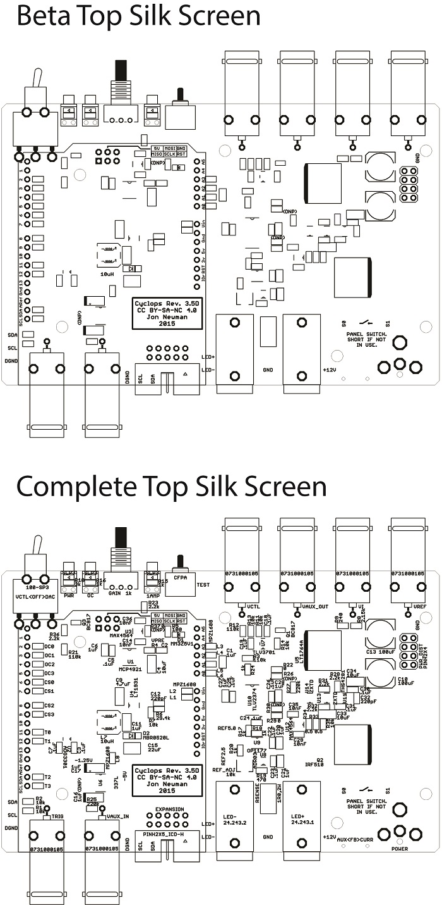
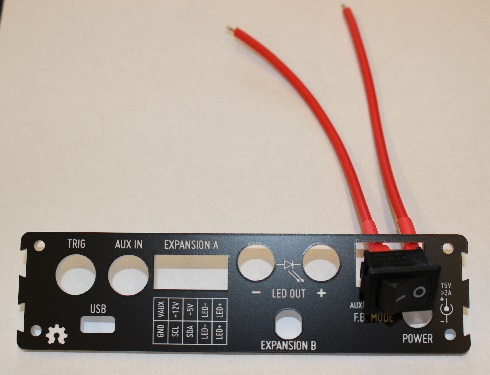
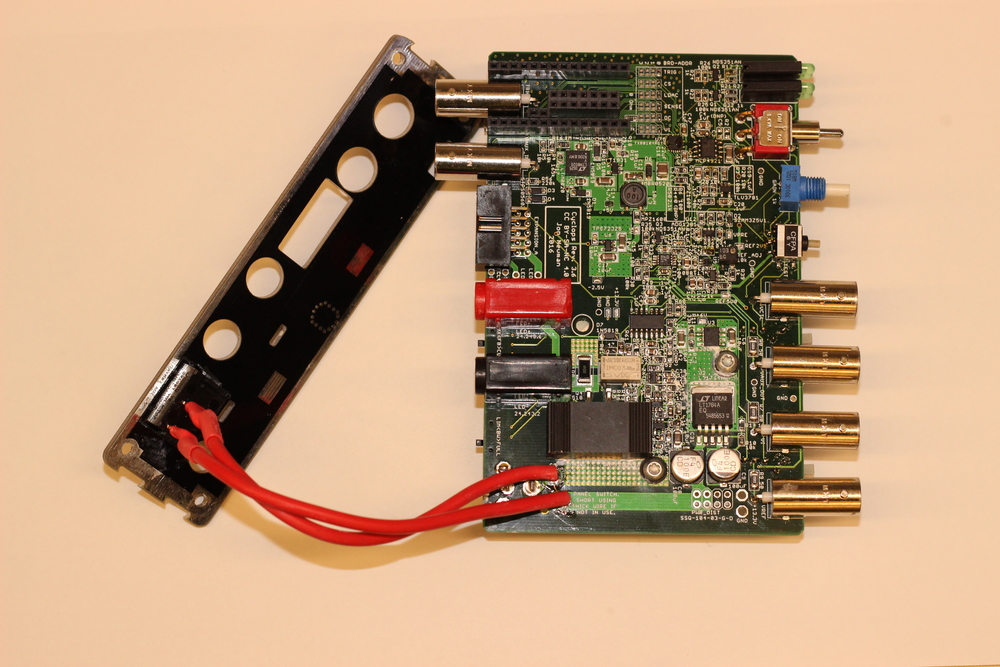
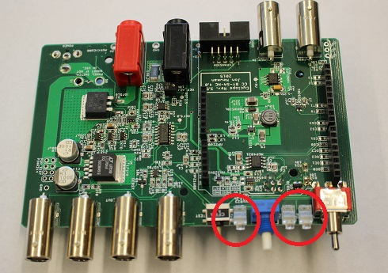
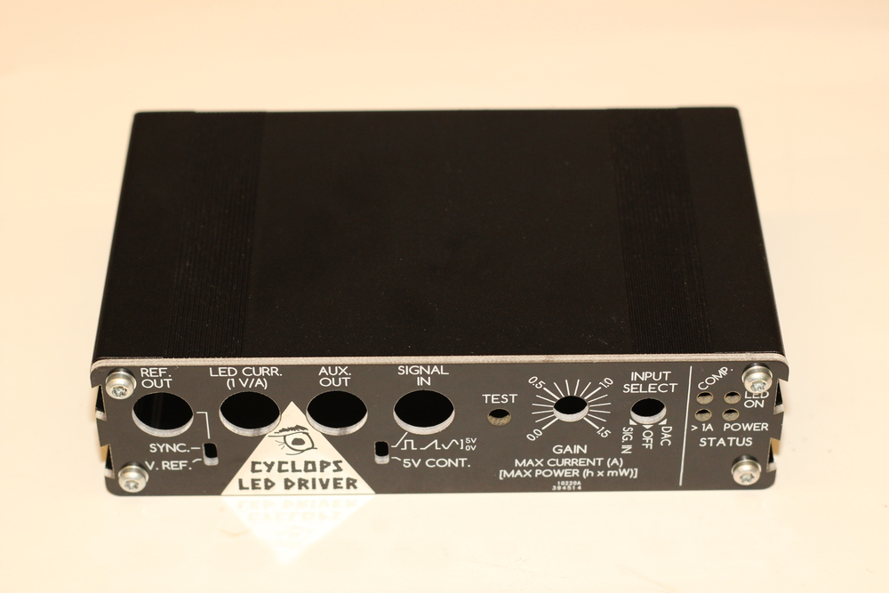
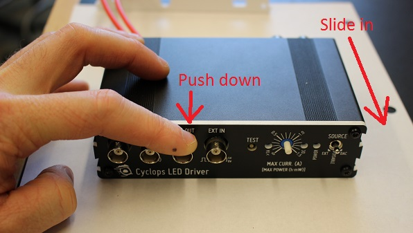
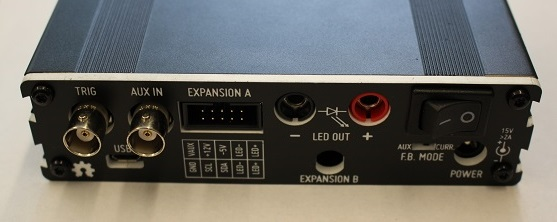
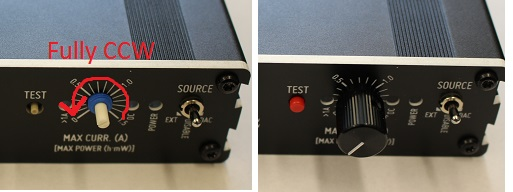

## Thank you for purchasing a Cyclops LED driver kit!
This  guide provides instructions that will allow you to assemble your Cyclops
kit. For details on performance specifications, usage, and assembly, please have a look
at the complete manual available in PDF or markdown form on the Cyclops github
repo.

> https://github.com/jonnew/Cyclops/blob/master/MANUAL.md

If you have any questions, do not hesitate to post them to the open-ephys
mailing list where I will try to reply with great precision and speed:

> https://groups.google.com/forum/#!forum/open-ephys

Also, __pull requests and bug reports are welcome__. I would love your help in
improving this device and its documentation!

### Attribution
This device is professional-grade scientific equipment. It has been a long road
to design and test the Cyclops, coordinate the acquisition of materials,
coordinate the manufacturing processes, and to distribute the device to the
community. This has been a lot of work but also a tremendous learning experience for me. I am very
happy that this device may enable your scientific endeavours and I'm sincerely
grateful to you for your interest in using the device. In general, I hope this
project will integrate as a small module into a of growing set of __high-quality__,
__open-source__, and __afforable__ tools that facilitate your research and
enable an __open__, __community-oriented__ approach to science.

All profits from the sale of Cyclops kits go to funding the open-ephys
non-profit initiative. Since I receive no monetary compensation from the sale
of these devices, it would mean a great deal to me if you would consider
referencing the following paper (for which the Cyclops was developed) in
published work that makes use of the Cyclops.

> J.P. Newman, M.-f. Fong, D.C. Millard, C.J. Whitmire, G.B. Stanley, S.M.
> Potter. S.M. Potter. Optogenetic feedback control of neural activity. _eLife_
> (4:e07192) 2015. doi: 10.7554/eLife.07192

For instance, in your methods section:

> Optical stimuli were delivered using the Cyclops LED driver (Newman, 2015;
> www.github.com/jonnew/Cyclops).

Thanks again for taking the leap and helping to take this project to the next
level. OK, let's get started.

### Beta "Features"
Tricked you. Before we actually get started, I wanted to let you in on a few
awesome features only available to pioneering beta users like yourself. I
assure you (see feature 3), that despite these very neat beta-only
characteristics, your Cyclops will kick just as much butt as those from the
next production round.

1. __Cool manually soldered linear regulator__

    It turns out that LT1764AEQ-1.8 is not the same as LT1764AEQ.
	
	
    
    For this reason, I had to manually replace every board's linear regulator after
    they had been been professionally assembled (Fig. TODO). Thank goodness for podcasts! The little marker dot on the large power trace at the
    front right corner of the board indicates that the replacement was made, just
    for you.

2. __Awesome minimal silkscreen layer__

    When I got the boards back from the assembler, I noticed they looked very
    minimal and streamlined. "Must be a result of those super precise pick and
    place machines", I thought to myself. "Amazing how much cleaner a robot can
    solder than......where the f\*\*\* are the component labels?" (Fig. 2)
    
    
    
    This one was my fault. I failed to adequately RTFM. At least the Cyclops
    artwork is still on the back of the PCB. Without that, it doesn't work. If you
    want to know the value of the components and names of solder points on the
    board (e.g. to hack it, which I thoroughly encourage), Figure XX shows the
    complete silkscreen.
	
    
	
3. __Sweet quality control check__

    Given the aforementioned kinks in the manufacturing process, I wanted to ensure
    the functionality of each board. Therefore, we performed pretty extensive quality
    control testing on each PCB that we shipped. The results are included with
    your kit. This is a true beta-only feature. I don't plan on doing this for
    any more production runs, especially since 75/75 boards passed the test with
    flying colors :).

### Kit Contents
OK, for real this time, lets get started.

Your kit contains the following items

1. Assembled Cyclops PCB (1x)
1. Extruded aluminium enclosure (1x)
1. Laser-cut enclosure panels (1x front, 1x rear)
1. Rocker switch (1x)
1. Hookup wire (2x)
1. Shrink tube (2x)
1. Gain knob (1x)
1. Light pipes (3x)
1. Button cover (1x)
1. Heatsink (1x)
1. Screws to install panels (8x)

Ensure that the kit is complete before starting. If not, contact me at
jpnewman@mit.edu, and I will send the missing parts immediately.

Your kit does __not__ contain the following items:

1. An LED to drive [Required]

  - See the [complete manual](../MANUAL.md) for options.

1. A power supply [Required]

  - Any wall-wart, battery pack, or bench-top power supply providing 15-20 VDC that
    can source >=2A will work.
  - The power jack is __center positive__ (but reversing this will not ruin the
    device, it just wont turn on).
  - Look around and see if you have a wall-wart laying around the lab that
    meets the specs. They are pretty common and the jack is likely to fit.
  - Digikey part number 1470-3096-ND is a good option for those that need to buy a supply.

1. Arduino [Optional]

  - The Cyclops contains onboard overcurrent protection circuitry and a 12-bit
    digital to analog converter to generate arbitrary optical patterns. Both of
    these features require you an Arduino Leonardo or equivalent to be
    installed, and for the device to be programmed using the Cyclops Arduino
    Library. 
  - This is __not__ required to use the Cyclops for optical stimulation: you just
    need to provide stimulus waveforms or triggers to the EXT IN BNC from some
    other source.

1. An M8, 4-pin connector [Optional]

  - An inexpensive, standard, non-insane, 2x5 header (`EXPANSION A`) provides
    access to most of the internal signals on the Cyclops board, e.g. for
    driving an LED or providing auxiliary feedback using an amplified photodiode
    etc.
  - An expensive, strange, moderately insane, M8 expansion connector that is used by two
    major companies in the optics space (`EXPANSION B`) is left unpopulated. You can populate
    this port if you wish to drive Thorlabs or Doric LED modules using the
    Cyclops. For instructions, see this the complete manual.

### Assembly Instructions

1. Assemble the power switch

    

  - Strip about 1 cm of insulation from each end of the hookup wires
  - Solder the hookup wire to the switch
  - Slide the heat shrink over the solder joints and hit then with a hot air gun
    or pass a lighter underneath them to shrink them into place.

1. Prepare the panels

    
	
  - Pull the paper backing off the panels
  - Press the the power switch into position on the back panel. The orientation
    does not matter. It will snap into place.

1. Install the heatsink on the PCB

  - Flip the PCB so that the bottom is exposed. 
  - Locate the large white square indicating the silkscreen location
  - Remove the paper backing from the heatsink to the adhesive surface
  - Press the heatsink into place on the PCB
  
1. Install the power switch on the PCB. 

    

  - Solder the power switch in place on the PCB after
  - The solder points are accidentally covered in solder mask, but there should
    be plenty of exposed copper on the inner part of the via to get a good
    joint. Sorry about that. 

1. Install the light pipes on the PCB.

    
	
  - Insert the light pipes in the mounting positions in the front of the PCB. 
  - Squeeze them into place firmly using some needle nose pliers or sturdy forceps.

1. Install the front panel on the enclosure

    
	
  - Using 4 of the 8 mount screws that came in the little plastic bag _outside_
    of the enclosure box, install the front panel on the enclosure.
  - Don't use the screws that came with the box, they are are too tight and too
    weak. I had to petition the box manufacture to send me the replacement
    screws because of this.

1. Install the PCB in the enclosure. 

    

  - Slide the PCB into the box using the _middle_ rail
  - When the BNC connectors come through the front panel, you will need to push
    them down a bit, slightly flexing the PCB to get the light pipes through
    the front panel. This is required to hold the light pipes in place. 

1. Install the rear panel. 

    

  - Loop the two hook up wires and push them into the enclosure on top of the PCB. 
  - Use the panel the push the remaining wire into the enclosure.
  - Use the remaining 4 screws to install the rear panel

1. Install gain knob and button cover.

    
	
  - Turn the dial on the front panel _fully counter-clockwise_
  - Slip the gain knob over the dial with the tick mark pointed slightly below the 0 position
  - Tighten the set screw on the side of the knob to lock it into place using an Allen key.
  - When you turn the knob fully clockwise, the tick mark should be pointing at the 1.5A position.
  - Press the red button cover over the `TEST` switch.

Congratulations, you are the proud owner of a high-precision, high-power,
high-speed LED driver that will make commercial drives feel a bit ridiculous
for costing so much and very self-concious about their performance
characteristics. For further usage instructions, performance specs, theory of
operations, etc, etc, please refer to the complete manual located on the
repository. As stated previously:

1. If you have trouble during the assembly process, please don't hesitate to
   contact the [open-ephys forum](https://groups.google.com/forum/#!forum/open-ephys), where I will do my best to provide a quick and
   accurate response.
1. Pull requests and issue submissions are __welcome__ on the github repo and
   open ephys forum. If you have criticisms, fixes, etc, please let us know so
   we can implement them ASAP.

Happy stimulating.

Jon Newman
MWL@MIT
2016-02-20

