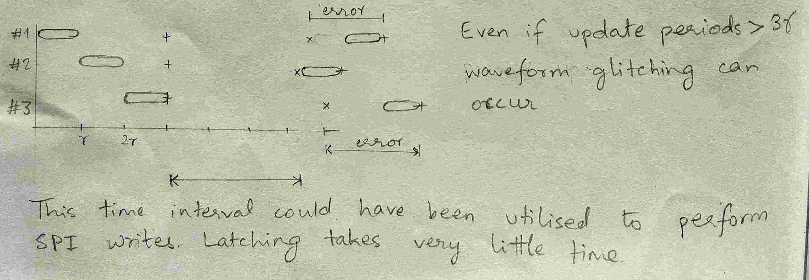
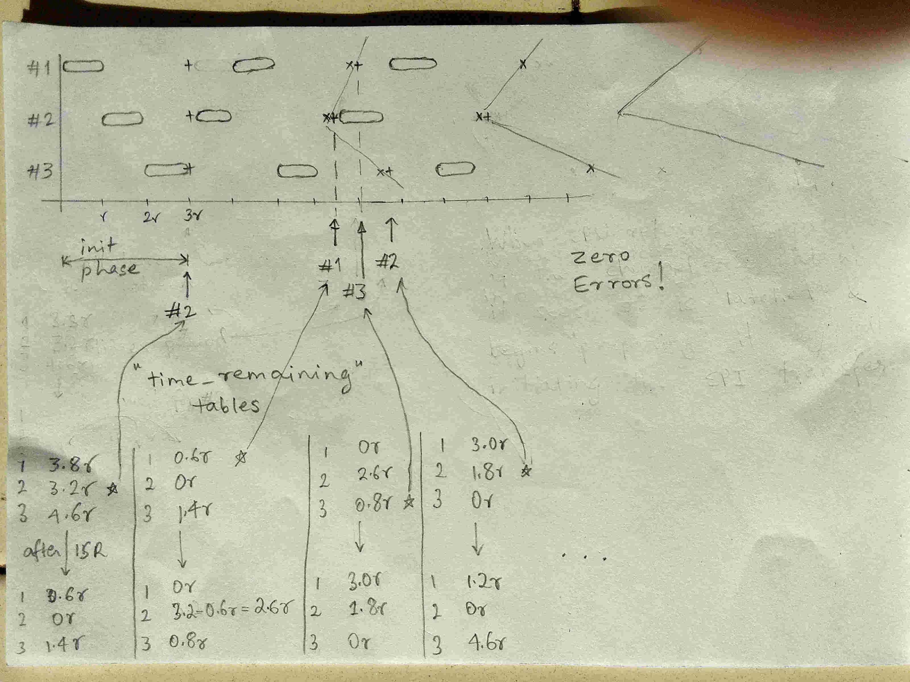

# Handling multiple Waveform channels
The problem we have here is because multiple channels have to utilise a shared resource (SPI bus) asynchronously. This is a well studied Operating Systems problem and there are 2 solutions: *Synchronised Access* (using "locks" / "global flags") or *Scheduling*.  
Scheduling of arbitrarily timed requests is not possible, but enforcing some assumptions *(or restrictions)* on the nature of requests helps simplify design.  
Synchronisation ignores timing altogether and is hence not an option for Cyclops.

>Note, 2B can be transfered on SPI in no less than 640 ns (25MHz). Typical SPI speeds are 15MHz => 1067 ns.

# Naive Approach [4 timers]

Setup one timer for each channel. Also, a separate Latch Line should be made available as the channels might not always be in sync. (Separate Latch Lines are available already, or probably some change is needed on the PCB?)

Consider a square wave of period \\(P\\) and duty cycle of 40%.
At each timer interrupt,

1. the period would change from \\(0.4 \times P\\) to \\(0.6 \times P\\) or vice versa.
2. the corresponding voltage would be written via SPI to Cyclops DAC.
3. Latch line would be activated, for this particular DAC.

## Cons
What would happen if timer triggers overlap? There is only 1 SPI resource which must be shared by all 4 channels. This means, a channel trigger might have to wait, effectively *"glitching"* that channel's waveform.  
We cannot guarantee precise waveforms with this approach.

# Single Timer, with lazy Latch and quick SPI write

A single hardware timer is used. It's period is updated at each "event" (interrupt).
> Using multiple timers would require proper synchronisation. Scheduling is not possible with multiple timers, and hence no guarantees on precise updates can be made.

This would require implementation of waveform objects and a task queue. These objects have various other benefits too.
Assumption #3 *(below)* could be asserted by the Cyclops library, giving a warning like
```
Precise updates cannot be guaranteed because few waveforms have very small update times.
```

(atleast for stored waveforms) after compilation.

## Some Assumptions and Notations
1. Say \\(N\\) Waveform channels (\\(W_{i}\\)) are active.
2. SPI writes require \\(\gamma\\) seconds for a 2B write.
3. A waveform would *never* require an update within \\(N \times \gamma\\) seconds.
4. Separate Latch Lines to each DAC are available.
5. Timer Interrupt has highest priority. (This does not increase latency of implementing commands from PC. Teensy has programmable interrupt priorities.)

>**Note that the Naive approach does not guarantee precise updates even under assumption #3.**

#### Explanation of Assumption #3
To guarantee precise waveform updates, our minimum time-period is limited by the SPI transfer speed. To update \\(N\\) channels even once we require a minimum of \\(N \times \gamma\\) seconds, since the updates cannot be done parallely.


If the set of writes violates #3, no schedule of these writes can ensure precise updates of *all channels*, even in the future. But even when assumption #3 is valid, proper scheduling is required or glitching would occur, as shown below.



## Waveform objects
These provide methods `nextVoltage()` and `holdTime()` which return the voltage needed at next interrupt point and the time to hold that voltage level resp.
Waveform objects can be in one of 3 states: 

* `init`
    - Just after boot, nothing written to DAC.
* `prepared`
    - "Next" value has been written in DAC.
* `latched`
    - DAC has been latched after the timer interrupt. DAC needs to be prepared for next interrupt.
    - transition from `prepared` to `latched` happens in an ISR, whereas `latched` to `prepared` does not.


Every waveform object has a `time_remaining` field. `time_remaining` field is the time for which the voltage needs to held at the current level from "this" interupt-instance onwards.

## Modus Operandi

The CPU is primarily tasked with `Preparing_DACs`. It tries to prepare DACs as fast as possible with their `nextVoltage`. The DACs are latched by the CPU when the timer interupts.
Just after boot, timer interrupts are ignored till all active channels have moved from `init` to `prepared`.
When there are no more channels in `init`, CPU latches all of them together and sets the timer-period to the smallest `holdTime`.

### Interrupts
Take a leap of faith and say, at some point in operation, an interrupt has fired:
The timer interrupts CPU to latch a [prepared DAC](#prepared).
Say the interrupt was for latching \\(W_{2}\\).

0. Disable interrupts.
3. Find which channel *(explained below)* needs to be latched now. (\\(W_{2}\\))
1. If \\(W_{2}\\) is `prepared` => `3i` else `4`
    2. Latch the value already in the `DAC2` *(which was meant to be latched* **now** *)*, using it's dedicated Latch Line.
7. Store the `W2.holdTime()` in `W2.time_remaining`.
4. Find which Channel *(explained below)* would require an update first, say \\(W_{0}\\). **This is the most important step.**
5. Update the timer period to trigger for \\(W_{0}\\), use `W0.time_remining` to compute the new period.
10. Subtract `W0.time_remining` from all others `WX.time_remaining`.
6. Increment the sequence count of \\(W_{2}\\).
8. \\(W_{2}\\) is now `latched`!
9. Enable interrupts. 

>The ISR is very short.

>An `SPI_DONE` interrupt desects all chips.

At the next timer interrupt, \\(W_{0}\\)'s DAC would be latched first thing, guranteeing a precisely timed update.
The system behaviour can be dscribed as `latch the prepared DAC` -> `prepare the next DAC` -> `latch next DAC on next interrupt`.


#### How does ISR determine next Timer Period?
The CPU finds out which channel needs to be "Latched" **now**. Every waveform object has a `time_remaining` field. `time_remaining` field is the time for which the voltage needs to held as such from "this" interupt-instance onwards.
At *"this"* interrupt instance, `W2.time_remaining == 0`, and say,
```
W0.time_remaining = 50 ns
W1.time_remaining = 65 ns
W2.time_remaining = 0 ns
W3.time_remaining = 184 ns
```

This means, \\(W_{2}\\) needs latching right now and \\(W_{0}\\) is the next candidate.
The ISR subtracts `W0.time_remaining` from all `prepared` Waveforms' `time_remaining`, because, at the next timer interrupt, `W0.time_remaining` nano-seconds would have elapsed.
>If assumption #3 is not violated, `time_remaining` would always be non-negative. 

This would make:
```
W0.time_remaining = 0 ns
W1.time_remaining = 15 ns
W2.time_remaining = 30 ns = W2.holdTime() - 50 (say 80 - 50 ns)
W3.time_remaining = 134 ns
```

The next interrupt would latch \\(W_{0}\\) and update all `time_remaining` for the correct execution of the next to next interrupt.  
Below is a sample timing diagram.



See the `time_remaining` tables, which are updated at each "latch event".

1. The first common latch event enables the timer and `W2.time_remaining` was set as the timer-period (3.2 \\(\gamma\\)).  
2. When \\(W_{2}\\) was latched, `W1.time_remaining` was set as the timer period (0.6 \\(\gamma\\)).  
Also notice that the CPU was able to initiate an SPI transfer (bus was free ,CPU was free and \\(W_{2}\\) was not `prepared`) right after exiting previous ISR. No time is wasted.  
3. \\(W_{1}\\) was latched as soon as timer triggered an interrupt because CPU was essentially free, it only *inititates* SPI transfers. `W3.time_remaining` was set as the timer period (0.8 \\(\gamma\\)). And so on...

### CPU's task
Continuing the scenario, the CPU has just serviced an interrupt for \\(W_{2}\\) and *(obviously)* atleast \\(W_{2}\\) is in `latched` state. That means CPU needs to prepare them by initiating an SPI transfer if the SPI bus is free. If it is not, CPU doesn't need to wait, whenever it is not servicing an interrupt it would try to "prepare" this DAC.

To enable a PC link, Reading and parsing Serial data also becomes a task. Timer interrupt is above all tasks, though.  
Below is the detailed CPU task diagram.


#### Implement PC Command
Commands like update waveform type, play, pause, reset, sync, phase shift etc would be handled by the CPU when it is not in the Timer ISR. In the rare case that a change was made to the very Waveform which is being serviced in an ISR, the change would be reflected as soon as CPU returns from the ISR: inducing a delay of atmost \\(N \times \gamma\\) seconds.

Commands which have long data streams can be assigned to the DMA controller. Say, a new waveform is being downloaded, the CPU only needs to setup memory for it and then leave the rest to DMA controller. The DMA controller would place all the data from the Serial buffer into the allocted memory. The `Waveforms::nextVoltage()` would do the rest.

### Overview

Combined with Task Queue, the lazy-latch-early-write gurantees minimal "glitches" in waveforms and never forces the CPU in `busy-wait` . DMA controller simply cannot produce "glitch free" waveforms.  
I believe this is the best that can be done.

The following is a Class diagram.


The following depicts a typical instantiation of the system.
